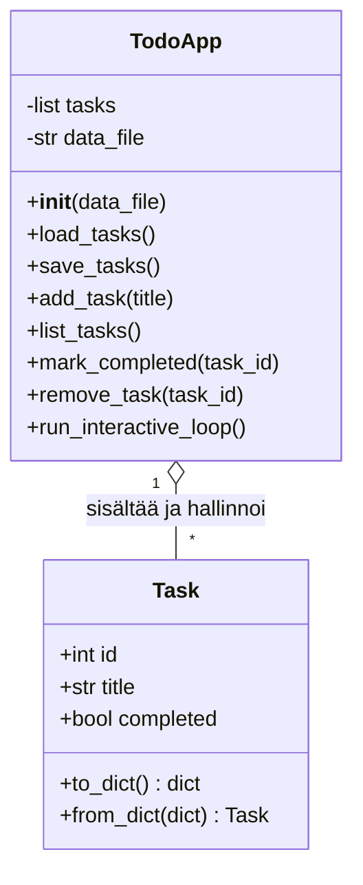
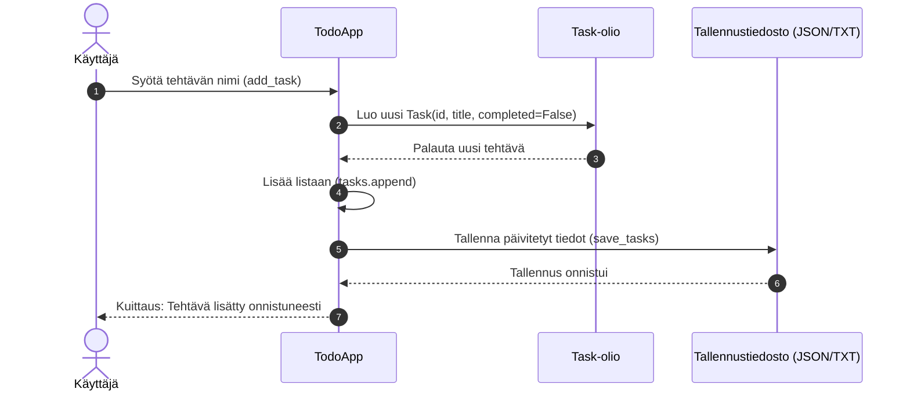
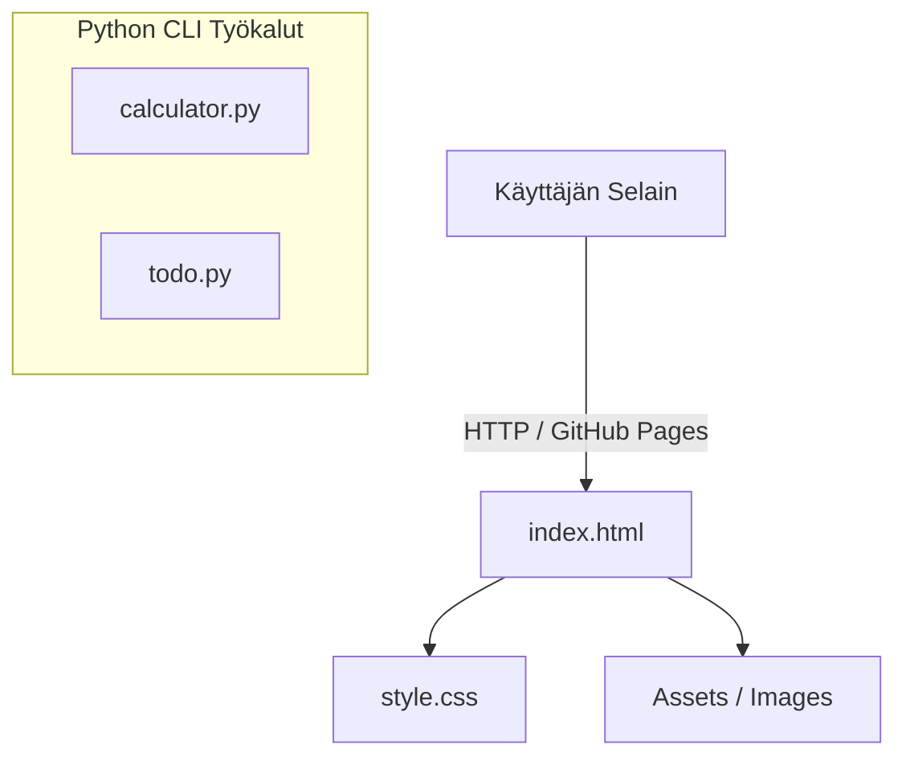

# UML-arkkitehtuuri ja kaaviot

Tässä dokumentissa kuvataan repositorion keskeisten ohjelmistokomponenttien rakenne ja toimintalogiikka UML-kaavioiden avulla.

---

## 1. Luokkakaavio: To-Do CLI -sovellus (`todo.py`)

Alla oleva luokkakaavio kuvaa tehtävänhallintasovelluksen tietomallin ja toimintalogiikan.

---

## 2. Toimintokohtainen sekvenssikaavio: Tehtävän lisääminen

---

## 3. Komponenttikaavio: Portfolio & Scriptit

